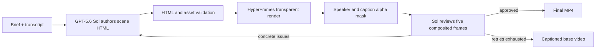
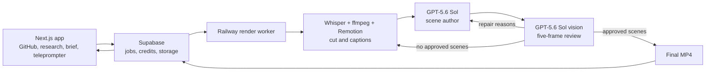

# Proof

Proof turns a founder's GitHub work into a researched, scripted, recorded, and edited product
video.

Technical founders can ship software faster than they can explain it. Good projects disappear
because research, scripting, filming, and editing become a second job. Proof handles that work
while the founder chooses the angle and records the take.

**OpenAI Build Week track:** Work and productivity

[Live app](https://tryproof.org) ·
[Backup deployment](https://proof-build2026.vercel.app) ·
[No-signup recording demo](https://proof-build2026.vercel.app/#demo) ·
[GPT-5.6-rendered output](https://www.youtube.com/shorts/5Q1ufojJ_f4) ·
[Build Week evidence](OPENAI_BUILD_WEEK.md)

[](https://www.youtube.com/shorts/5Q1ufojJ_f4)

## What Proof does

```text
GitHub repository
    -> current web research
    -> ranked content angles
    -> scene-by-scene brief
    -> browser teleprompter
    -> transcription and cutting
    -> captions and generated graphics
    -> vision review and repair
    -> vertical MP4
```

1. Connect GitHub and choose a project.
2. Proof extracts the parts worth showing and researches current angles.
3. GPT-5.6 ranks the angles and writes a filming brief.
4. Record each scene in the browser or upload existing footage.
5. The render service transcribes, cuts, captions, authors motion graphics, reviews the rendered
   frames, and returns the final MP4.

The landing page includes a one-scene recording demo that works without an account.

## What changed during Build Week

Proof existed before OpenAI Build Week and previously placed 1st Runner-Up at 'Sup Build2026.
The eligibility boundary is commit
[`adb92bc`](https://github.com/abel123code/proof/commit/adb92bcd9517fffaf875207d0da7be968ddc6c1e),
created before the July 13 submission window.

The initial product already had GitHub analysis, research, briefs, recording, base rendering,
and an optional GPT-authored scene pipeline. Build Week turned that pipeline into the normal,
tested GPT-5.6 path:

- migrated judgment-heavy work to GPT-5.6 Sol and structured high-volume work to GPT-5.6 Luna
- enabled original-detail, five-frame vision review on the normal render path
- made render mode operator-owned at both the Next.js route and Railway worker
- removed runtime switches that could bypass vision QA and made unexplained rejections produce a
  usable repair issue
- added a deterministic speaker and caption alpha mask
- removed fixed graphics that the scene author could not repair
- hardened remote assets against SSRF, local-file reads, redirects, and oversized streams
- added durable render jobs, credit refunds, onboarding, upload fixes, and a no-signup demo

The exact commit boundary is documented in [`OPENAI_BUILD_WEEK.md`](OPENAI_BUILD_WEEK.md).

## Why GPT-5.6

Proof uses Sol for research, angle judgment, scene authoring, and rendered-frame QA. Luna handles
structured work such as repository understanding, brief drafting, and visual-template selection.
`whisper-1` supplies the word timestamps used for cuts and captions.

Two GPT-5.6 capabilities map directly to the render problem:

- GPT-5.6 improves frontend layout, hierarchy, and design judgment. Proof asks Sol to author the
  HTML and animation for each scene.
- GPT-5.6 preserves original image dimensions when image detail is `auto` or `original`. Proof
  uses explicit `detail: "auto"` so QA reviews the rendered frame rather than a reduced thumbnail.

The complete role map and code paths are in [`OPENAI_BUILD_WEEK.md`](OPENAI_BUILD_WEEK.md).

## The vision-reviewed render loop



Approval requires `{ "ok": true, "issues": [] }`. Empty output, malformed JSON, unsafe HTML,
missing assets, and rejected frames fail closed. A rejected scene never reaches the final
composite. If no generated scene survives, Proof returns the valid captioned base video.

## Locally observed verification

These results were observed on July 21 during the Codex task that produced this branch. The
test and build commands are reproducible below. The public Short proves the final artifact, not
the internal retry log.

| Check | Result |
|---|---|
| Web tests | 52 passed |
| Render service tests | 62 passed |
| Production Next.js build | Passed |
| Live Sol and Luna API requests | Passed |
| Live Responses web search | Passed |
| Live Sol image input with `detail: "auto"` | Passed |
| FFmpeg alpha-mask pixel test | Passed |
| Full eight-second talking-head fixture | Completed |
| Vision result | Two variants rejected, second repair approved |
| Output | 1080x1920 MP4 with audio |
| Public generated output | [Watch on YouTube](https://www.youtube.com/shorts/5Q1ufojJ_f4) |

The full fixture took 397 seconds on the local Windows verification machine because Sol rejected
two variants before approving the third. It caught duplicate values, weak entrance contrast,
and malformed headline copy.

## Fastest verification path

1. Watch the [GPT-5.6-rendered output](https://www.youtube.com/shorts/5Q1ufojJ_f4).
2. Open the [no-signup recording demo](https://proof-build2026.vercel.app/#demo).
3. Inspect the adaptive loop in:
   - [`render/src/premium/index.ts`](render/src/premium/index.ts)
   - [`render/src/premium/qa.ts`](render/src/premium/qa.ts)
   - [`render/src/premium/author.ts`](render/src/premium/author.ts)
   - [`render/src/ffmpeg.ts`](render/src/ffmpeg.ts)
4. Run the verification commands below.

## Architecture



The root package owns GitHub analysis, research, angle scoring, briefs, authentication, credits,
capture, and durable job creation. [`render/`](render/README.md) owns transcription, cutting,
captions, HyperFrames rendering, vision QA, ffmpeg composition, and final upload.

## Built with Codex

Codex recovered and audited the premium-render experiments, migrated each model role with tests,
traced the browser request that bypassed premium rendering, and ran the API and render checks.

The human decisions stayed explicit: keep the name Proof, focus on founders, enter Work and
productivity, make vision QA mandatory, assign Sol and Luna by workload, and leave Programmatic
Tool Calling out of a data-dependent repair loop.

The required `/feedback` Session ID comes from the Codex task that produced this branch and is
supplied through the Devpost submission.

## Local setup

Requirements: Node.js 20 or newer, FFmpeg, an OpenAI API key, and a Supabase project with GitHub
OAuth.

```bash
npm ci
cp .env.example .env.local
npm run dev
```

Apply the migrations in [`supabase/migrations/`](supabase/migrations/) in order, then start the
render service:

```bash
cd render
npm ci
npm run server
```

The public no-signup demo contains a fixed one-scene brief, so it can be tested without local
sample data or an account.

## Verification

```bash
# Web application
npm run verify
npm run build

# Render service
npm --prefix render run check
npm --prefix render run test:unit
```

Expected results: 52 web tests, 62 render tests, and a successful production build.

## Security and reliability

Model-authored HTML is validated before Chromium runs it. Remote assets are HTTPS-only,
host-allowlisted, DNS-checked, redirect-free, image-only, and size-bounded. Render routes verify
ownership before reserving credits, and failed starts are refunded. The full trust-boundary map
is in [`OPENAI_BUILD_WEEK.md`](OPENAI_BUILD_WEEK.md#trust-boundaries).

## Repository map

```text
src/app/                 Next.js pages and API routes
src/components/studio/   research, brief, recording, and render UI
src/lib/                 OpenAI, GitHub, auth, database, and brief logic
render/src/premium/      scene authoring, sanitization, assets, and vision QA
render/remotion/         captions and deterministic base visuals
supabase/migrations/     schema, RLS, credits, durable jobs, and onboarding
tests/                   web application tests
render/tests/            render service tests
```

## Team

- Abel Lee: web application, research, briefs, teleprompter, authentication, and credits
- Abhishek Vulla: render service, cutting, generated scenes, vision QA, and Build Week integration
