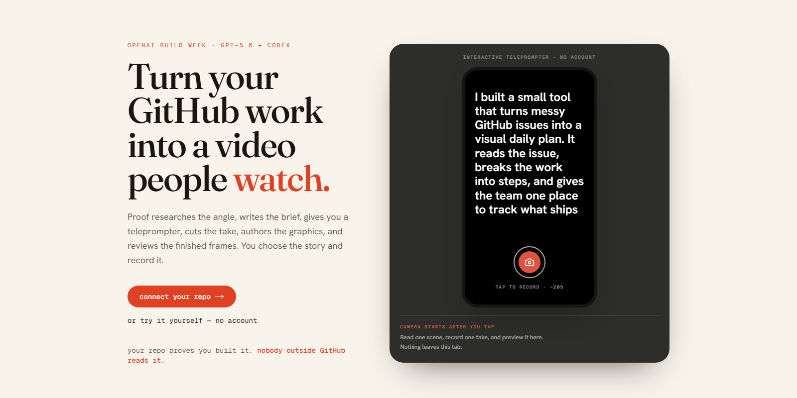

# Proof

  <strong>Turn your GitHub work into a product video people watch.</strong>

  Proof researches the story, writes the filming brief, gives you a teleprompter, cuts the take,
  authors the motion graphics, reviews the rendered frames, and delivers a vertical MP4.

  
  
  
  
  
  

  <a href="https://tryproof.org"><strong>Live app</strong></a> ·
  <a href="https://proof-build2026.vercel.app/#demo">No-signup recording demo</a> ·
  <a href="https://youtu.be/2bPF0pfeWAo"><strong>Build Week demo</strong></a> ·
  <a href="https://www.youtube.com/shorts/5Q1ufojJ_f4">Output edited by Proof</a> ·
  <a href="OPENAI_BUILD_WEEK.md">OpenAI + Codex engineering</a>

## The problem

Technical founders can ship software faster than they can explain it.

The proof is already in the repo: the feature, the hard bug, the benchmark, the decision that
made the product work. Nobody outside GitHub reads it. Turning that work into a good video means
researching an angle, writing a script, recording it, removing dead space, adding graphics, and
checking that the result does not look broken. That becomes a second job, so the launch becomes
a screenshot and four likes.

We built Proof because we kept shipping projects that worked and barely telling anyone about
them.

## What Proof does

~~~text
GitHub repository
    -> current web research
    -> ranked content angles
    -> scene-by-scene filming brief
    -> browser teleprompter
    -> word-level transcription and cutting
    -> captions and bespoke motion graphics
    -> five-frame visual review, auto-patch, ship flagged (never dropped)
    -> 1080x1920 MP4
~~~

1. **Connect a repository.** Proof reads the README, file tree, languages, and recent work.
2. **Choose the story.** GPT-5.6 researches current conversations and ranks several angles.
3. **Record it.** The selected angle becomes a filmable brief and browser teleprompter.
4. **Cut it.** Whisper word timestamps drive filler removal, dead-space cuts, captions, and scene
   anchors.
5. **Build the visuals.** GPT-5.6 Sol authors a fresh HyperFrames composition for each important
   beat.
6. **Review the pixels.** Sol inspects five composited frames and tags each issue `safety` (a
   graphic on a face feature or in the caption band, garbled text, a broken render) or `subjective`
   (creative taste). Safety faults are patched — the prior HTML is edited, not rerolled — up to the
   retry budget; a scene that still has one **ships flagged rather than being silently dropped**, and
   every scene carries an auditable `SceneReport` the app can show the user.
7. **Deliver.** Approved graphics are composited over the real footage and uploaded as a vertical
   MP4.

## OpenAI inside the editor

Proof treats video editing as a chain of decisions. GPT-5.6 is the creative decision layer.
TypeScript orchestrates the pipeline, while HyperFrames, Remotion, and FFmpeg execute the pixels.

| Work | OpenAI model | Why |
|---|---|---|
| Repository understanding and proof extraction | <code>gpt-5.6-luna</code> | Structured, high-volume JSON work |
| Missing-information questions and filming brief | <code>gpt-5.6-luna</code> | Fast drafting against the selected angle |
| Current trend and reference research | <code>gpt-5.6-sol</code> + Responses web search | Source-grounded judgment |
| Angle generation and scoring | <code>gpt-5.6-sol</code> | This choice controls the whole downstream video |
| Scene authoring | <code>gpt-5.6-sol</code> | Layout, hierarchy, animation, and asset use |
| Rendered-frame review | <code>gpt-5.6-sol</code> with vision | Approval or named visual defects |
| Speech timing | <code>whisper-1</code> | Per-word timestamps for cuts, captions, and anchors |

The reasoning policy is deliberate. Luna runs with no reasoning for mechanical JSON work. Sol
web research and premium render calls use low reasoning for bounded latency. Angle scoring keeps
the model default because quality matters most there. Premium effort is configurable from
<code>none</code> through <code>max</code>, invalid values fail during configuration, and every
premium request has a 90-second deadline with one transient retry.

Sol proposes the angle rubric dimensions, but it cannot self-award the final rank. Proof clamps
every dimension to 0–100 and recomputes the weighted score in deterministic TypeScript before
sorting the candidates.

~~~mermaid
flowchart TD
    repo["GitHub repository"] --> luna["GPT-5.6 Luna understand product and extract proof"]
    luna --> solResearch["GPT-5.6 Sol + web search research demand and rank angles"]
    solResearch --> brief["GPT-5.6 Luna write the filming brief"]
    brief --> record["Founder records one take browser teleprompter"]

    record --> whisper["OpenAI Whisper word timestamps"]
    whisper --> cut["FFmpeg remove fillers and dead space"]

    brief --> author["GPT-5.6 Sol author bespoke HTML and animation"]
    cut --> composite["Captioned talking-head footage"]
    author --> sanitize["Validate model-authored HTML reject external references, eval, and local files"]
    sanitize --> hyperframes["HyperFrames render transparent motion graphics"]
    hyperframes --> mask["Speaker and caption alpha mask"]
    composite --> mask
    mask --> vision["GPT-5.6 Sol Vision review five composited frames"]

    vision -- "named visual issues" --> author
    vision -- "approved" --> final["FFmpeg final composite 1080x1920 MP4"]
    vision -- "retries exhausted" --> fallback["Keep valid captioned base"]

    codex["Codex engineering loop scout, implement, test, review, live verify"] -. "built and verified" .-> luna
    codex -. "built and verified" .-> vision
~~~

## Engineering, the hard parts

The API calls are the easy part. The work is making their output safe, repairable, timed to real
speech, and reliable enough to hand back to a user.

<strong>1. A visual QA loop that reviews the rendered result</strong>

The scene author returns HTML. HTML alone cannot tell us whether a title clipped, a logo vanished,
or a graphic landed across the speaker's face.

Proof renders the scene, composites it over the real footage, samples the entrance, early state,
midpoint, late state, and exit, then sends all five PNGs to Sol with explicit
<code>detail: "auto"</code>. Approval requires exactly
<code>{ "ok": true, "issues": [] }</code>. Empty output, malformed JSON, or a named issue rejects
the scene.

The next author attempt receives the same scene intent plus concrete defects such as “move the
title above the speaker” or “replace duplicated caption text with a real visual.” A scene that
still has an unresolved safety fault at the end of the retry budget **ships flagged rather than being
silently dropped**, carrying an auditable `SceneReport` the app can surface; the captioned base is the
per-scene fallback only when a scene cannot be rendered at all.

A full eight-second production fixture rejected two variants and approved the second repair. QA
caught duplicated values, weak entrance contrast, and malformed headline copy before the final
composite.

Main code: [<code>render/src/premium/qa.ts</code>](render/src/premium/qa.ts),
[<code>render/src/premium/index.ts</code>](render/src/premium/index.ts), and
[<code>render/src/premium/author.ts</code>](render/src/premium/author.ts).

<strong>2. Model-authored HTML is treated as hostile input</strong>

Sol writes executable HTML that runs in headless Chromium. Proof validates it before rendering.

The composition sanitizer rejects external URLs, protocol-relative references, traversal,
embedded documents, network APIs, dynamic imports, <code>eval</code>, and
<code>new Function</code>. GSAP is copied into the scene directory and runs locally.

User-supplied image URLs pass through a second boundary. Assets must use HTTPS, match an allowed
hostname, resolve to public IP addresses, avoid redirects, return an image content type, and stay
within a streamed byte cap. Bare file paths and <code>file://</code> URLs are rejected.

Main code: [<code>render/src/premium/sanitize.ts</code>](render/src/premium/sanitize.ts) and
[<code>render/src/premium/asset-source.ts</code>](render/src/premium/asset-source.ts).

<strong>3. Cuts and animations stay attached to spoken words</strong>

Sentence timestamps are too coarse for editing. A cut that lands inside a word sounds broken,
and a graphic anchored to the old timeline drifts after silence is removed.

Proof extracts product names, acronyms, and keyword flags from the brief into a capped vocabulary
hint for <code>whisper-1</code>. It removes filler and dead-space segments, then remaps every
surviving word and scene anchor onto the cut timeline. Zero-duration Whisper words receive a
visible floor without overlapping the next word.

The overlay renderer never touches the source video. FFmpeg owns the footage. Remotion and
HyperFrames render transparent layers. This avoids source-video seek failures and keeps the
final composite deterministic.

Main code: [<code>render/src/transcribe.ts</code>](render/src/transcribe.ts),
[<code>render/src/cut.ts</code>](render/src/cut.ts),
[<code>render/src/remap.ts</code>](render/src/remap.ts), and
[<code>render/src/job.ts</code>](render/src/job.ts).

<strong>4. The speaker is protected before the model gets a vote</strong>

Prompt instructions alone did not keep generated graphics away from the speaker and burned-in
captions. Proof adds a deterministic alpha mask after HyperFrames rendering. Pixels inside the
speaker corridor and caption band become transparent before visual QA sees the scene.

This gives the model a safe canvas and lets vision QA focus on design, copy, clipping, and asset
use. The mask is covered by a real FFmpeg ProRes alpha-pixel test.

Main code: [<code>render/src/ffmpeg.ts</code>](render/src/ffmpeg.ts).

<strong>5. Render reliability is measured, not guessed</strong>

A render combines Chromium, Remotion, HyperFrames, FFmpeg, OpenAI calls, and Supabase uploads.
Proof stores job state in Postgres, reclaims stale work after worker restarts, reserves credits
before dispatch, and refunds a render that never starts.

Whole jobs and premium scenes use separate semaphores. A Railway load test using concurrent
15-second renders found the safe operating point. One render took 34.4 seconds. Two completed at
27.6 seconds per job. At three, FFmpeg exhausted the worker's memory. The production cap is two.

Main code: [<code>src/app/api/render/route.ts</code>](src/app/api/render/route.ts),
[<code>render/src/server.ts</code>](render/src/server.ts), and
[<code>render/src/semaphore.ts</code>](render/src/semaphore.ts). The measurement is recorded in
[<code>DECISIONS.md</code>](DECISIONS.md).

## Built with Codex

Codex was the primary engineering environment for this build. It worked across the Next.js app,
the Railway render worker, Supabase migrations, OpenAI model calls, HyperFrames, FFmpeg, and the
test suites.

| Codex work | Human decision |
|---|---|
| Recovered the premium-render work across branch history and mapped the live call paths | Keep one product and make the complete founder workflow the submission |
| Migrated each workload to GPT-5.6 Sol or Luna and added parameter tests | Spend Sol on judgment and Luna on structured volume |
| Traced a browser request that silently bypassed vision QA | Make render mode operator-owned in both services |
| Used the OpenAI Docs MCP and live API checks to verify model parameters | Keep only integrations that passed against current documentation and the real API |
| Rendered a real fixture and inspected rejected frames | Add deterministic speaker and caption protection |
| Used isolated worktrees, GitHub CLI, and parallel review agents for implementation and audit | Keep the active checkout safe and make every public claim traceable |
| Used Playwright to inspect the landing page at desktop and mobile widths | Replace the generic hero with a product-specific render and QA view |
| Built regression coverage around every failure found | Treat rendered output, not generated code, as the acceptance test |

## Proof that it runs

| Check | Result |
|---|---|
| Web tests | 61 passed |
| Render-service tests | 107 passed |
| TypeScript checks | Passed in both packages |
| Production Next.js build | Passed |
| Live GPT-5.6 Luna JSON request | Passed |
| Live GPT-5.6 Sol planning and authoring | Passed |
| Live Sol Responses web search | Passed |
| Live Sol vision request with original-detail input | Passed |
| FFmpeg alpha-mask pixel test | Passed |
| Full production-code fixture | Two rejections, second repair approved |
| Final fixture | 1080x1920 MP4 with audio |
| Narrated Build Week demo | [Watch on YouTube](https://youtu.be/2bPF0pfeWAo) |

Run the repeatable checks:

~~~bash
npm ci
npm run verify
npm run build

npm --prefix render ci
npm --prefix render run check
npm --prefix render run test:unit
~~~

The no-signup landing demo contains its own one-scene brief, so judges can test recording without
an account or local sample data.

## Local setup

Requirements: Node.js 20 or newer, FFmpeg, an OpenAI API key, and a Supabase project with Google
OAuth.

~~~bash
npm ci
cp .env.example .env.local
npm run dev
~~~

Apply the migrations in [<code>supabase/migrations/</code>](supabase/migrations/) in order. Start
the render worker separately:

~~~bash
npm --prefix render ci
npm --prefix render run server
~~~

The render contract and deployment controls are documented in
[<code>render/README.md</code>](render/README.md).

## Repository map

~~~text
src/app/                 Next.js pages and API routes
src/components/studio/   research, brief, recording, and render UI
src/lib/                 OpenAI, GitHub, auth, database, and brief logic
render/src/premium/      scene authoring, sanitization, assets, and vision QA
render/remotion/         captions and deterministic base visuals
supabase/migrations/     schema, RLS, credits, durable jobs, and onboarding
tests/                   web application tests
render/tests/            render-service tests
~~~

## Team

- **Abel Lee:** web application, GitHub research, briefs, teleprompter, authentication, and credits
- **Abhishek Vulla:** render service, transcription, cutting, generated scenes, vision QA, and
  OpenAI Build Week integration

## OpenAI Build Week

Track: **Work and productivity**.

The detailed model map, Codex development record, trust boundaries, verification evidence, and
dated commit trail are in [<code>OPENAI_BUILD_WEEK.md</code>](OPENAI_BUILD_WEEK.md).

## Licence

[MIT](LICENSE).
