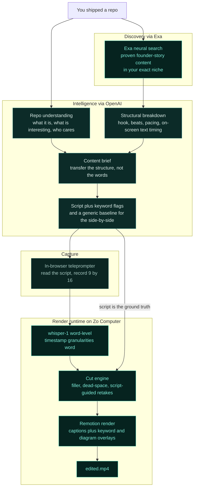

<h1 align="center">proof</h1>

<p align="center">
  You shipped something good. Nobody saw it. proof turns a GitHub repo into a recruiter-facing short-form video by reverse-engineering what already works in your niche, so technical builders get seen without becoming content creators.
</p>

<p align="center">
  
  
  
  
  
</p>

<p align="center">
  <a href="#what-it-does">What it does</a> &middot;
  <a href="#the-side-by-side-the-whole-pitch-in-one-screen">The side-by-side</a> &middot;
  <a href="#how-it-works">How it works</a> &middot;
  <a href="#engineering-worth-reading-the-code-for">Engineering</a> &middot;
  <a href="#built-with">Built with</a> &middot;
  <a href="#run-it-locally">Run it</a>
</p>

<p align="center">
  <strong>Live demo:</strong> <a href="#">add-your-url</a> &middot; <strong>2-minute walkthrough:</strong> <a href="#">add-your-url</a>
</p>

> the advice every technical job-seeker gets is "build your personal brand, post, make content." the people who most need it won't do it. it's not CS, it feels cringe, the activation energy is too high. so they ship something real and it dies in a void.

Recruiters spend about 11 seconds on a GitHub profile. Building a project costs almost nothing now, so the bottleneck moved. It's not "can you build it," it's "did anyone see it." proof fixes the second half. You connect a repo, it studies what's already performing in your niche, and it hands you a brief and a script that aren't generic AI slop. You read the script off a teleprompter. A real render runtime cuts your dead air and mistakes, adds captions and overlays, and gives you back a finished MP4. You never have to learn video editing or "do content."

## What it does

You point it at a repo you're proud of. A few minutes later you have a short-form video you'd actually put on a profile, and you didn't write a hook, learn pacing, or open a video editor.

The loop:

- **Connect a repo.** It reads the README, file tree, and languages, and figures out what the project actually is, what's technically interesting, and who would care.
- **Research your niche.** Exa pulls the founder-story content that's genuinely performing for builders like you, not generic "how to go viral" advice. That pool is the reference material.
- **Reverse-engineer the structure.** It breaks a proven clip down into its transferable skeleton: the hook, the beat order, the pacing, when on-screen text lands. Not the words. The shape.
- **Get a non-slop brief and script.** It pours your project's real substance into that proven shape and flags the exact phrases that should get an on-screen overlay. It also generates a plain generic version next to it, so you can see the difference.
- **Read it off a teleprompter.** Record in the browser, 9:16, no setup.
- **Get a finished MP4.** A render service on a real Linux box transcribes you word by word, cuts the filler and dead space and retakes, burns in karaoke captions plus keyword and architecture overlays, and renders the video.

The dashboard is review-and-approve, not a manual editor. The whole thesis is that these users won't do video work, so making them drag clips on a timeline would defeat the point. You approve each step and watch it think.

## The side-by-side, the whole pitch in one screen

This is the part that matters. "AI writes you a script" is saturated and everyone can smell it. The product is the judgment of *which* structure to borrow and *which* phrases to push, learned from content that actually worked in your niche.

So every script ships next to a generic baseline. Same repo, same facts, both generated. One is grounded in your niche, one is what you'd get from a blank-prompt chatbot.

```text
GENERIC AI                                   proof  (after reverse-engineering your niche)

"Hi everyone! Today I want to share a        "I shipped a thing that cuts the dead air
project I've been working on called proof.    out of your own videos using the script you
It's an AI-powered platform that helps        read off the teleprompter. here's the part
developers create engaging video content      that took three rewrites to get right."
to showcase their work. Let me walk you
through the key features..."                  → opens on the single most interesting
                                                technical decision, the way the clips that
→ opens on a throat-clear nobody watches        actually land in this niche all do
→ words like "engaging" and "platform"        → names the real mechanic, no filler
→ feature tour, recruiter already scrolled    → keyword flags marked for overlays
```

The generic column is stored in the same `scripts` row (`generic_content`) as the real one. It's not a strawman we wrote to win an argument. It's the actual baseline output, kept so the difference is real, not a claim.

## How it works



Two things to notice. Exa sits at the front as the research brain, and Zo sits at the back as the render runtime. Everything in between is reasoning. And the `SCRIPT` node feeds the cut engine a second time: because you read a known script off the teleprompter, the render can align your messy transcript to it and cut cleanly. That arrow is the unlock.

One more detail the diagram hides: every file that crosses the boundary between the Next app and the Zo box travels as a Supabase Storage URL, never as bytes through an API route. Supabase is the file bus.

## The eight phases

The whole thing is one Next.js app plus one render service on Zo. State moves through eight Supabase tables, one per phase, so any step can resume and the dashboard can show real progress instead of a spinner.

| # | Phase | What happens | Where it runs |
|---|-------|--------------|---------------|
| 1 | Connect repo | GitHub API pulls README, file tree, languages | Next route |
| 2 | Understand | OpenAI turns the repo into a structured understanding | Next route |
| 3 | Research and reverse-engineer | Exa finds proven niche clips, OpenAI breaks each one down into its transferable structure | Next route |
| 4 | Brief | the project's substance is poured into a proven structure | Next route |
| 5 | Script | film-ready script plus keyword flags, plus the generic baseline | Next route |
| 6 | Capture | teleprompter recording, 9:16 | browser |
| 7 | Transcribe | `whisper-1` word-level timestamps | Zo |
| 8 | Render | cut, caption, overlay, encode to MP4 | Zo |

Phases 1 through 6 are the research-and-brief half. Phases 7 and 8 are the render half. They agree on exactly one contract: a recording URL plus a brief JSON in, a finished MP4 URL out. That clean seam is why the two halves can be built in parallel and snap together.

## Engineering worth reading the code for

The interesting parts, each one a problem we hit, the gotcha, and what we did about it.

<details>
<summary><strong>1. The cut engine, and why the teleprompter script is the trick</strong>. three passes: filler, dead-space, and script-guided retake removal via sequence alignment.</summary>

Cutting filler and silence is easy. Cutting *mistakes* is the hard one, and it's where most auto-editors give up. We get it almost for free because of one design decision: the user reads a known script off a teleprompter, so we have ground truth for what they meant to say.

Three passes, in order, producing a `keepList` of original-timeline segments to keep back to back:

- **Filler removal.** Drop word-spans matching a filler set (`um, uh, er, like` used as a disfluency, `you know, i mean, basically, literally`) and standalone false-start fragments. Plain set-match on the word text.
- **Dead-space trim.** For any gap between two kept words longer than 700ms, trim it down to 180ms of padding. Keeps the natural breath, kills the void. Pure timestamp math.
- **Script-guided retake removal.** Align the spoken transcript to the brief's script with sequence alignment (LCS). A matched run that advances through the script is a keep. When the same script span shows up twice in the transcript, the speaker restarted the sentence, so we keep the *last* clean take and cut the earlier failed attempts.

The third pass is what makes the output look professionally edited instead of just trimmed, and it only works because we know the script in advance.

</details>

<details>
<summary><strong>2. Word-level timestamps are load-bearing, not a nice-to-have</strong>. `timestamp_granularities: ["word"]`, and the original-to-cut timeline remap that everything downstream depends on.</summary>

Karaoke captions and "an overlay appears the instant you say the keyword" both require knowing when each individual *word* starts and ends. Segment-level timestamps, the default, are useless for this. You have to explicitly ask the transcription API for word granularity:

```ts
timestamp_granularities: ["word"]   // → [{ word, start, end }, ...]
```

Then the second, less obvious problem: cutting moves everything. Once the cut engine removes spans, every surviving word is at a new time. A caption or overlay that fires at the *original* timestamp will be late by the total duration of everything cut before it, and it gets worse as the video goes on.

So after cutting we remap every kept word from the original timeline to the post-cut timeline. The new start of a word is the sum of all kept-segment durations before it. We keep an `originalMs → cutMs` map and run both captions and overlay cues through it. Remotion's only timing primitive is `<Sequence from={frame} durationInFrames={n}>`, and the bridge from seconds to frames is `frame = round(seconds * 30)` at 30fps. Get the remap wrong and the captions drift off the words. It's the kind of bug that looks fine on a five-second test and falls apart on a real take.

</details>

<details>
<summary><strong>3. Eight per-phase routes and a file bus, not one long route and not a job queue</strong>. why the boring middle option is the right one for this product.</summary>

The render is CPU-heavy and takes 30 seconds to two minutes. That rules out doing it inside a Vercel serverless route, which would time out. The two tempting extremes are both wrong here: one giant route blows the timeout, and a real job queue with workers is too much to stand up and too opaque to demo.

What we did instead:

- **Per-phase routes.** Each phase is its own route that does one thing and persists its result to its own Supabase table. The dashboard calls them in sequence and shows a real "analyzing repo, done, reverse-engineering, done" stepper. Judges and users get to watch the agent think instead of staring at a spinner, which demos far better than a single black-box call.
- **Async render with polling.** The render route hands the job to Zo and gets back a `jobId`. The dashboard polls for status. No held-open connection, no timeout.
- **Supabase as the file bus.** The recording and the finished MP4 live in Supabase Storage. The Next app and the Zo box exchange URLs and a small brief JSON, never file bytes. Both halves already talk to Supabase, so the seam is free.

It's the unglamorous middle path, and it's the correct one. It survives a Vercel timeout, it resumes, and it shows its work.

</details>

<details>
<summary><strong>4. Exa is the difference between a brief and slop</strong>. structure transfer grounded in what performs, with the generic baseline kept for proof.</summary>

The naive version of this product is "LLM, write me a script about my repo." You can feel how generic that is, and so can a recruiter. The actual product is judgment: given content that is genuinely working for builders in your niche, which structure should you borrow and which phrases should you push.

That judgment is only as good as its input, and that input is Exa. Generic scraping gets you hashtag soup. Exa's neural search gets you the founder-story content that's actually landing for people shipping work like yours, which is the raw material the rest of the pipeline reasons over. Swap Exa for a keyword scrape and the briefs regress to the generic column above.

The transfer prompt is deliberate about this: take the proven structure (hook style, beat order, pacing, on-screen-text rhythm) and pour *this* project's real substance into it, named and specific. Never the reference's words, never hype like "revolutionary" or "game-changing." And we generate the plain generic version alongside, stored in the same row, so the lift from Exa-grounded structure is something you can see rather than something we claim.

</details>

<details>
<summary><strong>5. Zo Computer is the render runtime, not a deploy target</strong>. a real Linux box running ffmpeg plus headless Chromium plus Remotion as a background service.</summary>

Remotion renders by driving a headless browser and compositing frames, then ffmpeg encodes. That is a full Linux workload, not something a serverless function can hold. The render genuinely needs a real machine that stays up, and that machine is Zo.

Zo runs an Express server in process mode, the background mode that stays alive across the whole session, exposing `POST /render` and `GET /render/:jobId`. Per job it downloads the recording from Supabase, transcribes word-level, runs the cut engine, remaps the timeline, builds the Remotion props, renders with the `remotion render` CLI, uploads the MP4 back to Supabase, and flips the job to done. ffmpeg, a headless Chromium, Node, and the composition all live on the box.

The product cannot render without a machine like this. Vercel can host the dashboard, but the heavy compute that turns a raw take into a finished video has to live on a real computer running real binaries, and that is what Zo is here. It is infrastructure the product depends on, not a place we happened to deploy to.

There is a fallback path baked in for the venue: if many tiny cut segments choke Remotion's per-segment `<OffthreadVideo>`, pre-concat the kept segments into one clean clip with ffmpeg first, then let Remotion overlay captions on the single clip. Simpler and faster, same output.

</details>

<details>
<summary><strong>6. A vertical reference pool, not "tech videos"</strong>. a narrow founder-story classifier that rejects almost everything.</summary>

The reference pool is only useful if it's actually the right genre. "I built X and here's the story" is a narrow lane, and most of what a broad pull returns is tutorials, generic SaaS advice, news about other people's products, or lifestyle content that happens to use the same hashtags.

So discovery is two-stage: a cheap deny-list drops the obvious off-genre noise for free (crafts, makeup, recipes, fitness) before spending a model call, then an LLM classifier keeps a clip only if it's a person telling the first-person story of a software product they built. When it's unsure, it rejects. A view floor prefers clips that actually performed, with a fallback that keeps the top performers so a strict floor can never starve the pool. The narrowness is the point. A precise pool is what makes the reverse-engineering specific instead of mush.

</details>

## Built with

Two of these are load-bearing in a way the product could not exist without. The rest are how it's built.

**Central:**

- **[Exa](https://exa.ai), the research intelligence.** Neural search that finds the founder-story content actually performing in your niche. This is the input the entire brief depends on. Without it, the scripts collapse into the generic baseline. It's the front of the pipeline, not a feature bolted to the side.
- **[Zo Computer](https://zo.computer), the render runtime.** A real Linux box running ffmpeg, headless Chromium, and Remotion as a background HTTP service. The render is heavy compute that has to live on a real machine, and this is that machine. The product can't produce an MP4 without it.

**The rest of the stack:**

- **OpenAI** for repo understanding, the reference-clip breakdown, brief and script generation, and `whisper-1` word-level transcription.
- **[Remotion](https://remotion.dev)** for the composition: cut base video, karaoke captions, keyword and architecture overlays, encoded to H.264.
- **Next.js 16** (App Router) for the dashboard and the per-phase API routes, **Tailwind** and **shadcn/ui** for the dark technical-IDE look.
- **Supabase** (Postgres plus Storage) as the eight-phase state store and the file bus between the app and Zo.
- **GitHub API** for the repo snapshot, **Apify** for fetching the matched reference clips.

Built with **Codex** and **Cursor** in the loop.

## Run it locally

The app and the render service are separate. The app runs anywhere Next runs. The render service wants a real Linux box (this is the Zo half).

**The app:**

```bash
npm install
# create the schema in your Supabase project
psql "$SUPABASE_DB_URL" -f supabase/migrations/0001_init.sql
npm run dev   # http://localhost:3000
```

Keys it needs, by purpose:

- `OPENAI_API_KEY` for repo understanding, brief, script, transcription
- `EXA_API_KEY` for niche research and content discovery
- `GITHUB_TOKEN` for the repo snapshot (optional for public repos, just a higher rate limit)
- `APIFY_API_TOKEN` for fetching the matched reference clips
- `NEXT_PUBLIC_SUPABASE_URL` and `SUPABASE_SERVICE_ROLE_KEY` for state and file storage

**The render service** lives in `render/` and runs on Zo: install Node, ffmpeg, and a headless Chromium, `npm i`, and start the Express server in process mode. It needs `OPENAI_API_KEY` for transcription and the two `SUPABASE_` keys to move files. See [`docs/zo-remotion-render-prd.md`](docs/zo-remotion-render-prd.md) for the full contract.

## Acknowledgments

Built for [Build2026](https://www.supcareer.app), the 'Sup World Tour proof-of-work hackathon, on the Future of Work track. Thanks to Exa and Zo Computer for the tools that the product is genuinely built on, and to OpenAI (Codex) and Cursor.

`#supcareer #build2026 #hackathon #PetaniAI`

## License

[MIT](LICENSE).
