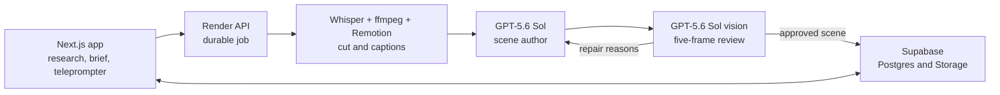

# Proof

Proof turns a founder's GitHub work into a short vertical product video. It finds the proof in
the repo, researches current angles, writes a scene brief, records each take in a browser
teleprompter, and returns a cut, captioned MP4 with reviewed motion graphics.

[Product site](https://tryproof.org) | [OpenAI Build Week notes](OPENAI_BUILD_WEEK.md)

> Demo video: TODO. Add the public link after the final recording is uploaded.

## Product flow

```text
GitHub -> grounded research -> ranked angles -> brief -> teleprompter -> render -> MP4
```

1. Connect GitHub and select a project.
2. Run web-search research and generate ranked content angles.
3. Turn the selected angle into a scene-by-scene filming brief.
4. Record or upload one take per scene.
5. Send the footage to the render service. Proof transcribes, cuts, captions, authors graphics,
   reviews rendered frames, and composites the approved result.

## Architecture



The repo has two packages:

- The root Next.js app owns GitHub analysis, research, angle scoring, briefs, auth, credits,
  footage capture, and durable render-job creation.
- [`render/`](render/README.md) owns Whisper transcription, cutting, Remotion captions,
  HyperFrames scene rendering, GPT vision review, ffmpeg composition, and final upload.

## OpenAI model roles

| Work | Default | Why |
|---|---|---|
| Angle scoring and other high-judgment text work | `gpt-5.6-sol` | Quality changes the product decision |
| High-volume structured work | `gpt-5.6-luna` | Lower-cost mechanical JSON tasks |
| Web-search research | `gpt-5.6-sol` with Responses web search | Current sources and extraction |
| Premium scene planning fallback, authoring, and vision QA | `gpt-5.6-sol` | Layout, repair, and visual judgment |
| Brief-driven visual template selection | `gpt-5.6-luna` | Small structured selection task |
| Word timestamps | `whisper-1` | Per-word timing for cuts and captions |

Each role is environment-overridable. The defaults live in
[`src/lib/openai.ts`](src/lib/openai.ts),
[`render/src/premium/`](render/src/premium/), and
[`render/src/visual-planner.ts`](render/src/visual-planner.ts).

## Render and vision QA

The normal user path is server-owned and defaults to `generated-experimental`. Only the server
environment can select a fallback. Operators can set `RENDER_EDIT_MODE` to `brief-driven` or
`classic`.

For each premium scene, Proof:

1. Builds a scene spec from the filming brief and transcript timing.
2. Asks Sol for one self-contained HyperFrames HTML composition.
3. Rejects unsafe HTML before Chromium sees it. External network references, traversal,
   dynamic imports, `eval`, and similar execution paths fail validation.
4. Renders a transparent MOV and clears authored pixels over the moving-speaker corridor and
   burned-in caption band.
5. Composites the scene over the real footage and samples five frames from entrance to exit.
6. Sends those frames with explicit `detail: "auto"`. GPT-5.6 processes `auto` at original
   detail.
7. Requires `{ ok: true, issues: [] }`. Empty, malformed, or rejecting responses fail closed.
8. Feeds concrete issues back to the author for up to two repairs.

If every authored scene is rejected or a premium request fails, Proof returns the captioned
base render. The user still receives a valid video.

The safety boundary combines model review with deterministic controls. Prompt instructions
help the author. Sanitization, the alpha mask, and fail-closed parsing enforce the result.

## Security and reliability

- Render routes authenticate the caller and verify brief ownership before spending credits or
  reading a job.
- Durable jobs live in `render_jobs`. Railway can reclaim queued jobs and stale processing
  locks after a restart.
- Remote scene assets are HTTPS-only, host-allowlisted, DNS-checked against private ranges,
  redirect-free, image-only, and size-bounded.
- Public tables added by early migrations use deny-all RLS. Owner-scoped tables keep their
  existing policies. Server routes use the service role with explicit ownership checks.
- Heavy renders use a measured concurrency cap of two. Premium scene renders use a separate
  cap of two.
- Premium OpenAI calls use a 90-second per-attempt deadline with one transient retry.

## Local setup

Prerequisites: Node 20+, ffmpeg, a Supabase project with GitHub OAuth, and an OpenAI API key.

```bash
npm ci
cp .env.example .env.local
npm run dev
```

Run the migrations in [`supabase/migrations/`](supabase/migrations/) in order. Approve a user
through `allowed_users`. Local development can run with auth bypassed when the public Supabase
anon key is absent.

Start the render service separately:

```bash
cd render
npm ci
npm run server
```

See [`.env.example`](.env.example) for the full secret-free configuration surface and
[`render/README.md`](render/README.md) for Railway and Zo setup.

## Verification

```bash
# Web app
npm run verify       # TypeScript + 52 tests
npm run build

# Render service
npm --prefix render run check
npm --prefix render run test:unit   # 59 tests
```

The Build Week verification also exercised live `gpt-5.6-sol` and `gpt-5.6-luna` requests,
Responses web search, image input at original detail, and one real SUTD fixture through the
complete render path. Sol rejected two scene variants, supplied repair reasons, approved the
third, and the final 1080x1920 MP4 differed from the caption-only fallback.

`npm run lint` currently reports seven pre-existing `react-hooks/set-state-in-effect` errors in
the admin and studio UI. This branch leaves those effect bodies unchanged.

## Repository map

```text
src/app/                 Next.js pages and route handlers
src/components/studio/   research, brief, teleprompter, and render UI
src/lib/                 OpenAI, GitHub, auth, database, and brief logic
render/src/premium/      scene plan, author, sanitizer, renderer, and vision QA
render/remotion/         deterministic captions and base overlay
supabase/migrations/     schema, credits, RLS, durable jobs, onboarding
tests/                   web app unit tests
render/tests/            render service unit tests
```

## Project history

Proof existed before OpenAI Build Week and placed 1st Runner-Up at 'Sup Build2026. The Build
Week work is scoped in [OPENAI_BUILD_WEEK.md](OPENAI_BUILD_WEEK.md) and the dated git history.

- Abel Lee: web app, research, brief, teleprompter, auth, and credits
- Abhishek Vulla: render service, cutting, bespoke scenes, and vision QA
